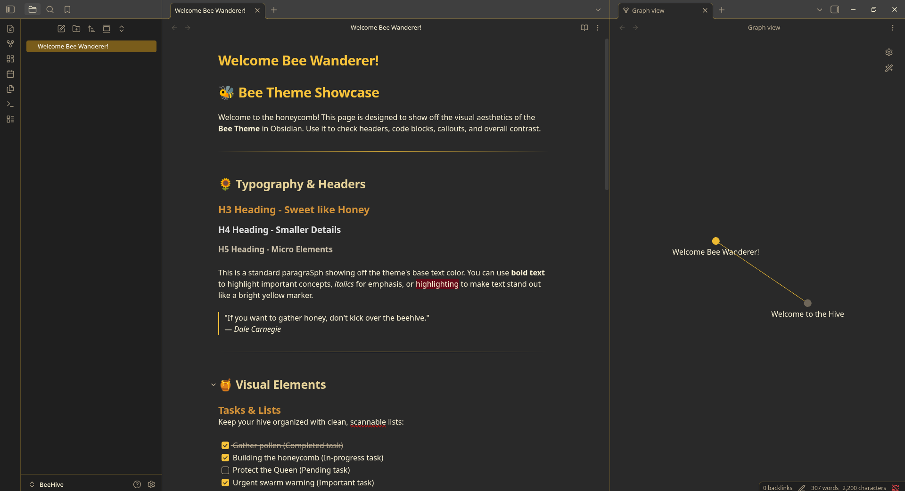
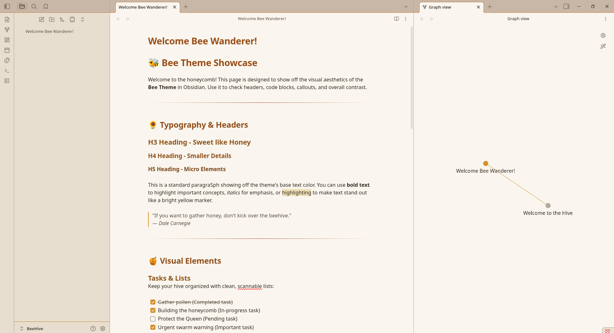

# Bee

A dark/light Obsidian theme with yellow and amber accents.

**Bee** is a modification of [**Wasp**](https://github.com/) by Santi Younger.

## Dark mode

Dark backgrounds with yellow accents.

## Light mode

Light cream backgrounds with amber accents.

## Install and Use

**Settings → Appearance → Themes → Manage** → search **Bee** → **Install** → select **Bee** as your theme.

## License

MIT — see [LICENSE](LICENSE).

**Bee**, based on **Wasp** by Santi Younger.

Wasp is free to use. If you like the original theme, leave a comment on one of Santi's latest [YouTube videos](https://www.youtube.com/@SantiYounger/videos) saying you use Wasp, or [send him an email](https://www.santiyounger.com/contact).
